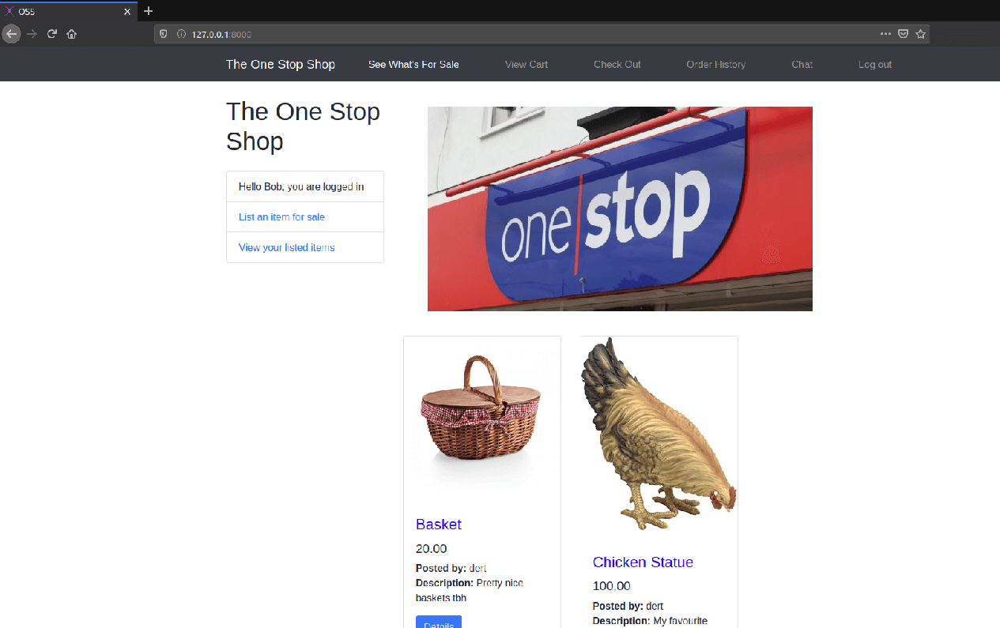

# Project
## Online Marketplace ##
An online marketplace that allows users to list products up for sale. Users are able to add, update and delete their product listings. Anyone can view the products listed for sale, but only authenticated users can add items to their cart, view the total price of their cart, input shipping information and finish their check out. Users can view what items they previously purchased by checking their order history. Users are also able to chat with sellers in real time.



## Getting Started ##
### Prerequisite Installations ###
The commands to install everything necessary for deployment are listed below.  
It's necessary to have Django 3.0 installed. This can be done by running the following command:
```
$ python3 -m pip install Django
```
Redis and Channels installations are also required:
```
$ sudo apt install redis-server
$ python3 -m pip install channels
$ sudo -H  pip3 install channels_redis
```
Lastly, Stripe installations are required:
```
$ python3 -m pip install stripe
$ python3 -m pip install --upgrade stripe
$ sudo pip install --index-url https://code.stripe.com 
```
## Deployment ##
Once everything necessary is installed, run the program with:
```
$ python manage.py runserver
```

## Running the tests ##
In order to run the test cases, use the following command:
```
$ python manage.py test
```

## Contributors ##
[Nathalie Paquin](https://github.com/natpaq "natpaq") | [Aidan Wadin](https://github.com/awadin "awadin") | [Michelle Lin](https://github.com/mchll-ln "mchll-ln") 
------------------------------------------------------|---------------------------------------------------|--------------------------------------------------------------
